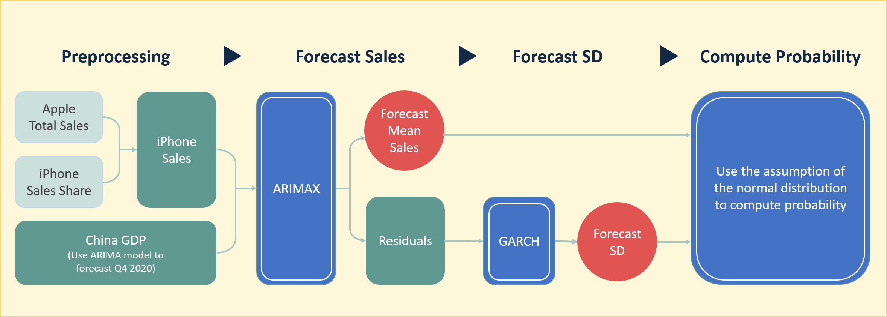
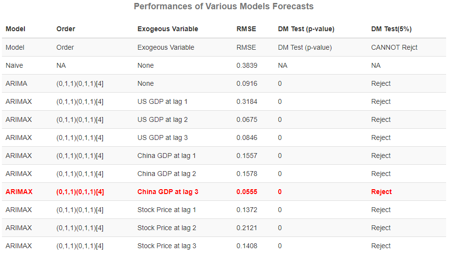

# Will Apple's iPhone net sales be higher in FY 2021 than FY 2019?

I attended an interesting forecasting challenge in [Good Judgement Open](https://www.gjopen.com/questions/1823-will-apple-s-iphone-net-sales-be-higher-in-fy-2021-than-fy-2019) , which is a crowd-sourced forecasting website, where real organizations post questions that they would like answered. This challenge is to predict iPhone's sales in 2021. According to the challenge page, iPhone sales have fluctuated over the years. 5G capability and COVID-19 probably cause some impacts both on the demand on and supply of iPhones. These factors introduce uncertainty on sales forecasting. In this project, I used approximately 12 years of quarterly sales data and also consider China GDP to built ARIMAX model. Simultaneously and implemented GARCH model to estimate standard deviations of sales at different time points. Based on the model,  iPhone sales are anticipated to be **$ 125,725 billions in 2021** and there might be only **3.8%** probability that 2021's sales is able to outstrip 2019's sales. 

## Software

R

## Method

Time Series Analysis, ARIMA, ARIMAX, GARCH, Dickey-Fuller test, Diebold-Mariano test

## Data

1. Apple's Total Revenue (2008 Q2 ~ 2020 Q4, source: WRDS) 
2. iPhone sales share of Apple's total revenue (2009 Q1 ~ 2020 Q4, source: [statista](https://www.statista.com/statistics/253649/iphone-revenue-as-share-of-apples-total-revenue/)) 
3. Chian GDP (1992 Q1 ~ 2020 Q3, source: [FRED](https://fred.stlouisfed.org/series/CHNGDPNQDSMEI)) 
4. US GDP (1947 Q1 ~ 2020 Q3, source: [FRED](https://fred.stlouisfed.org/series/GDP)) 
5. Apple Stock Price (1980 Q4 ~ 2020 Q4, source: [macrotrends](https://www.macrotrends.net/stocks/charts/AAPL/apple/stock-price-history)) 

## Process

 

1. Creating iPhone Sales data: In order to create iPhone sales time series data, I multiplied Apple's total sales by iPhone sales share of the total sales. 

2. Considering China GDP and other exogenous variables: According to [Statista](https://www.statista.com/statistics/382175/quarterly-revenue-of-apple-by-geograhical-region/), US and China are major countries bringing the most sales of iPhone in 2020. Therefore, I considered GDP in both countries as exogenous variables. Moreover, the stock market often reflects customer attitudes for a business, and thus Apple's stock historical prices probably offer useful information for forecasting. 

3. Before building models: I visualized iPhone sales series to inspect if there is any trend and seasonality and also plotted other exogenous variables to examine cointegration. Furthermore, I applied Dickey–Fuller test to determine if a series a stationary series and also conduct conintegration test to verify whether cointegration exists between iPhone sales and other exogenous variables or not.

4. During the model-building stage, I tried to use ARIMA and ARIMAX model with different exogeneous variables and various number of lags. After several time trials, I found China GDP at lag 3 can effectively and significantly eliminate RMSE on the validation period. Here are the results of trials.    

5. I used residuals from my best forecasting model to build GARCH model and predict standard deviations of 2021's sales. Below are 2021's forecasts.       

6. Since the question required to provide a probability that 2021 sales exceeds 2019 sales, so I I utilized standard deviations to compute the z-score of 2019's sales in the distribution of 2021's forecasts and then transformed the z-score into a probability based on the normal distribution assumption of the white noises. Here is the probability.  

   

   

 

## Conclusion 

In sum, iPhone sales are anticipated to be **$ 125,725 billions in 2021** and there might be only **3.8%** probability that 2021's sales exceed $ 142,384 billions. We can almost conclude that iPhone impossibly create a higher sales in 2021 than in 2019.

## More Details

Rpub: https://rpubs.com/crystalwanyulee/698729