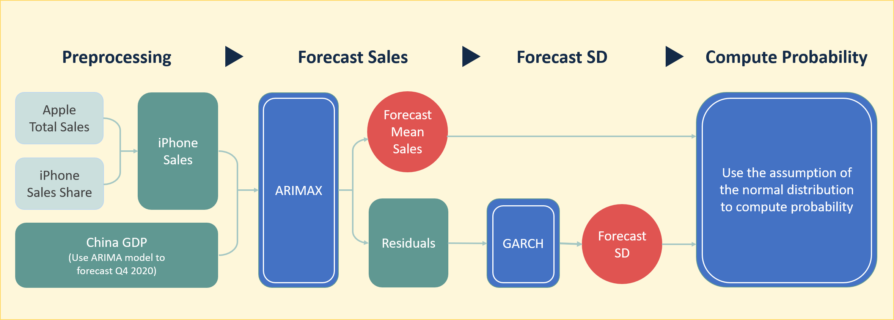

```{r setup, include=FALSE}
rm(list=ls())
library(forecast)
library(rugarch)
library(urca)
library(glue)
library(zoo)
library(latticeExtra)
library(xts)
library(DiagrammeR)
library(lubridate)
library(tidyverse)
library(kableExtra)
library(knitr)
```


## Challenge

#### Question: 
Will Apple's iPhone net sales be higher in FY 2021 than FY 2019?<br>

#### Link:
https://www.gjopen.com/questions/1823-will-apple-s-iphone-net-sales-be-higher-in-fy-2021-than-fy-2019<br>

#### Description:
Apple's iPhone net sales have fluctuated over the years, and as of October 2020 Apple has begun to sell the new iPhone 12 and its variants (Apple). Industry analysts speculate whether 5G capability will bolster declining iPhone sales or if the pandemic's global impact on supply chains and expendable income will hinder iPhone sales (9 to 5 Mac, ABS-CBN). Apple Inc.'s Fiscal Year (FY) annual report for 2021 is expected by early November 2021 at https://investor.apple.com/investor-relations/default.aspx under the "Annual Reports on Form 10-K" section. For FY 2020, Apple reported net iPhone sales of $137.781 billion, compared to $142.381 billion in FY 2019 (Apple 10-K (2020), see page 21).<br><br>


## Methodology
#### Data Source
1. Apple's Total Revenue (2008 Q2 ~ 2020 Q4, source: WRDS)
2. iPhone sales share of Apple's total revenue (2009 Q1 ~ 2020 Q4, source: [statista](https://www.statista.com/statistics/253649/iphone-revenue-as-share-of-apples-total-revenue/))<br>
3. Chian GDP (1992 Q1 ~ 2020 Q3, source: [FRED](https://fred.stlouisfed.org/series/CHNGDPNQDSMEI))<br>
4. US GDP (1947 Q1 ~ 2020 Q3, source: [FRED](https://fred.stlouisfed.org/series/GDP))<br>
5. Apple Stock Price (1980 Q4 ~ 2020 Q4, source: [macrotrends](https://www.macrotrends.net/stocks/charts/AAPL/apple/stock-price-history))<br><br>


#### Process:
```{r pressure, echo=FALSE, out.width = '100%'}

```

1. Creating iPhone Sales data: In order to create iPhone sales time series data, I multiplied Apple's total sales by iPhone sales share of the total sales. 

2. Considering China GDP and other exogenous variables: According to [Statista](https://www.statista.com/statistics/382175/quarterly-revenue-of-apple-by-geograhical-region/), US and China are major countries bringing the most sales of iPhone in 2020. Therefore, I considered GDP in both countries as exogenous variables. Moreover, the stock market often reflects customer attitudes for a business, and thus Apple's stock historical prices probably offer useful information for forecasting. 

3. Before building models: I visualized iPhone sales series to inspect if there is any trend and seasonality and also plotted other exogenous variables to examine cointegration. Furthermore, I applied Dickey–Fuller test to determine if a series a stationary series and also conduct conintegration test to verify whether cointegration exists between iPhone sales and other exogenous variables or not.

4. During the model-building stage, I tried to use ARIMA and ARIMAX model with different exogeneous variables and various number of lags. After several time trials, I found China GDP at lag 3 can effectively and significantly eliminate RMSE on the validation period. Here are the results of trials <br>

```{r echo=FALSE, message=FALSE}
model_performances = read.table('model_performances.csv', sep=';')
colnames(model_performances) = c("Model", "Order", "Exogeous Variable", "RMSE", "DM Test (p-value)")
model_performances['DM Test(5%)'] = ifelse(model_performances['DM Test (p-value)'] < 0.05,
                                           'Reject', 'CANNOT Rejct')
model_performances %>% 
  kable(format.args = list(big.mark = ","),
        caption='<h4><center><strong>Performances of Various Models Forecasts</strong></center></h4>') %>% 
  kable_styling(full_width = T, bootstrap_options = c("striped", "hover"), ) %>%
  row_spec(9, bold = T, color = "red")


```
<br><br>
5. I used residuals from my best forecasting model to build GARCH model and predict standard deviations of 2021's sales. Below are 2021's forecasts.<br>


```{r fig.width=10, fig.height=5, echo=FALSE, message=FALSE, warning=FALSE}
# Apple's total Revenue
apple_sales = read.csv('apple_net_sales_by_year.csv')
sales_ts = ts(apple_sales$revtq, start=c(2008,2), freq=4)
sales_ts = window(sales_ts, start=c(2009,1))

# iPhone sales share
iphone_share = read.csv('statistic_id253649_iphone-sales-as-share-of-apples-total-revenue-2009-2020.csv')
iphone_share = iphone_share[complete.cases(iphone_share), ]
iphone_share_ts = ts(iphone_share$X, start=c(2009,1), freq=4)


# Create iPhone sales data by multiplying Apple's total revenue by iPhone sales share
iphone_ts = sales_ts*iphone_share_ts/100

final_results = read.csv('final_results.csv')
final_results[, -1] = round(final_results[, -1])
final_results = final_results[, c(1,3,2,4)]
colnames(final_results) = c('Quarter', '2019 Actual Sales', '2021 Sales Forecast', '2021 Forecast SD') 
final_results['Quarter'] = c('Q1', 'Q2', 'Q3', 'Q4', 'Whole Year')
final_results['HI 95'] = final_results['2021 Sales Forecast'] + final_results['2021 Forecast SD']*1.96
final_results['LO 95'] = final_results['2021 Sales Forecast'] - final_results['2021 Forecast SD']*1.96

sales_2021_ts = ts(final_results[1:4, '2021 Sales Forecast'], end=c(2021, 4), freq=4)
iphone_ts = ts(c(iphone_ts, sales_2021_ts[1]), end=c(2021, 1), freq=4)
sales_2021_lo_ts = ts(final_results[1:4, 'LO 95'], end=c(2021, 4), freq=4)
sales_2021_ho_ts = ts(final_results[1:4, 'HI 95'], end=c(2021, 4), freq=4)


ggplot() +
  geom_line(aes(x= as.Date(time(iphone_ts)), y = iphone_ts), color='royalblue', size=1) +
  geom_line(aes(x= as.Date(time(sales_2021_ts)), y = sales_2021_ts), color='orangered', size=1) +
  geom_ribbon(aes(x= as.Date(time(sales_2021_lo_ts)), 
                  ymin = sales_2021_lo_ts, 
                  ymax = sales_2021_ho_ts,  
                  fill = '95% CI'),  alpha = 0.3) +
  theme_minimal() +
  scale_x_date(date_labels = "%Y", breaks=seq(as.Date("2009/1/1"), as.Date("2021/1/1"), "2 years")) + 
  labs(title='iPhone Sales Forecasts in 2021', x='', y='billion dollars') + 
  guides(fill=guide_legend(title="")) 

```
<br><br>

```{r echo=FALSE, message=FALSE}
final_results = read.csv('final_results.csv')
final_results[, -1] = round(final_results[, -1])
final_results = final_results[, c(1,3,2,4)]
colnames(final_results) = c('Quarter', '2019 Actual Sales', '2021 Sales Forecast', '2021 Forecast SD') 
final_results['Quarter'] = c('Q1', 'Q2', 'Q3', 'Q4', 'Whole Year')
final_results %>% 
  kable(format.args = list(big.mark = ","),
        caption='<h4><center><strong>Sales and Standard Deviation Forecasts</strong></center></h4>') %>% 
  kable_styling(full_width = T) %>%
  row_spec(5, bold = T, color = "white", background = "royalblue")
```
*Note: $\sigma_{2021} = \sqrt{(7,025^2+3,974^2+3,424^2+3,520^2)}=9,448$<br><br>

6.  Since the question required to provide a probability that 2021 sales exceeds 2019 sales, so I I utilized standard deviations to compute the z-score of 2019's sales in the distribution of 2021's forecasts and then transformed the z-score into a probability based on the normal distribution assumption of the white noises. Here is the probability.<br><br>

```{r echo=FALSE, message=FALSE}
z_score = (142384 - 125725)/9448
prob = round(1-pnorm(z_score),4)*100
```


  * $z = \frac{(142,384 - 125,725)}{9,448} = `r z_score`$
  * $P(2021 sales>2019sales) = `r prob`\%$
  
In sum, The probability is simply 3.89%. We can almost conclude that iPhone impossibly create a higher sales in 2021 than in 2019.<br><br>


## Codes:

### Import Apple-related Data

```{r}

# Apple's total Revenue
apple_sales = read.csv('apple_net_sales_by_year.csv')
sales_ts = ts(apple_sales$revtq, start=c(2008,2), freq=4)
sales_ts = window(sales_ts, start=c(2009,1))

# iPhone sales share
iphone_share = read.csv('statistic_id253649_iphone-sales-as-share-of-apples-total-revenue-2009-2020.csv')
iphone_share = iphone_share[complete.cases(iphone_share), ]
iphone_share_ts = ts(iphone_share$X, start=c(2009,1), freq=4)


# Create iPhone sales data by multiplying Apple's total revenue by iPhone sales share
iphone_ts = sales_ts*iphone_share_ts/100
log_iphone_ts = log(iphone_ts)

log_iphone_ts
```

### Import other Data

```{r message=FALSE, warning=FALSE}
# China GDP data 
china_gdp = read.csv('CHNGDPNQDSMEI.csv')
china_gdp_ts = log(ts(china_gdp$CHNGDPNQDSMEI, start=c(1992,1), freq=4))


# US GDP data
us_gdp = read.csv('USGDP.csv')
us_gdp_ts = ts(us_gdp$GDP, start=c(1947,1), freq=4)
us_gdp_ts = log(us_gdp_ts)


# Apple Stock Price
apple_price = read.csv('MacroTrends_Data_Download_AAPL.csv')
apple_price$date = as.Date(apple_price$date, format='%m/%d/%Y')
apple_price['year'] = year(apple_price$date)
apple_price['quarter'] = quarter(apple_price$date)

apple_price2 = apple_price %>%
  group_by(year, quarter) %>%
  summarize(price=mean(close))

apple_price_ts = ts(apple_price2$price, start=c(1980,4), freq=4)
apple_price_ts = log(apple_price_ts)

```


### Visualization

```{r fig.height=8, fig.width=8}
p1 = autoplot(iphone_ts, size=1) + 
     labs(title='iPhone Sales (Original)', y='log_sales', x='')

p2 = autoplot(diff(log_iphone_ts, 4), color='royalblue', size=1) + 
     labs(title='iPhone Sales (Seasonally Adjusted)', y='log_sales', x='')

p3 = autoplot(diff(diff(log_iphone_ts, 4), 1), color='orangered', size=1) + 
     labs(title='iPhone Sales (Seasonally Adjusted and Trend Removed)', y='log_sales', x='')

cowplot::plot_grid(p1, p2, p3, align = "v", nrow = 3)
```


```{r}
create_dual_axis_plot = function(ts1, ts2){
  par(mar=c(5, 4, 4, 6) + 0.1)
  plot(ts1, 
       main='iPhone Sales vs. China GDP', 
       pch=16, xlab="", ylab="", yaxt="n")
  axis(2,col="black",las=1)
  mtext("log_Sales",side=2,line=2.5)
  box()
  
  par(new=TRUE)
  plot(ts2, pch=15,  axes=FALSE, col="red",  xlab="", ylab="")
  mtext("log_GDP", side=4,col="red",line=4) 
  axis(4, col="red",col.axis="red",las=1)
}


```


```{r fig.height=8, fig.width=8}

par(mfrow = c(3, 1))

# Graph 1
create_dual_axis_plot(log_iphone_ts, china_gdp_ts)

# Graph 2
create_dual_axis_plot(log_iphone_ts, us_gdp_ts)

# Graph 3
create_dual_axis_plot(log_iphone_ts, apple_price_ts)
```

### DF Test

```{r}

df_test = function(ts, type){
  df_test = ur.df(ts , type=type, selectlags="BIC")
  sumStats = summary(df_test)
  teststat = round(sumStats@teststat[1],2)
  critical = sumStats@cval[1,2]
  reject = ifelse(teststat < critical, 
                  "CAN reject the null hypothesis, so it a stationary series with trend",
                  "CANNOT reject the null hypothesis, so it a non-stationary series with drift")
  glue("DF Test ({type}) \nTest Statistics: {teststat} \n5% Critical Value (tau) :{critical}\n-> {reject}\n ")
}
```


```{r}
cat('iPhone Sales\n')
df_test(log_iphone_ts , type='trend')
cat('\n\nChina GDP\n')
df_test(window(china_gdp_ts,start=c(2009,1), end=c()) , type='trend')
cat('\n\nUS GDP\n')
df_test(window(us_gdp_ts,start=c(2009,1)) , type='trend')
cat('\n\nApple Stock Price\n')
df_test(window(apple_price_ts,start=c(2009,1)), type='trend')
```


### Examine if any cointegration exists between iPhone sales, US GDP, and Apple Stock Price
>> According to Dickey–Fuller Tests on residuals, there is no cointegration between `iPhone sales` and `US GDP`, as well as `iPhone sales` and `Apple Stock Price`

```{r}
creg.model1 = lm(window(us_gdp_ts,start=c(2009,1)) ~ window(log_iphone_ts, end=c(2020,3)))
resid1 = residuals(creg.model1)
resid.ts1 = ts(resid1, start=c(2009,2), freq = 365)

cat('Regression Residuals (using iPhone Sales to model on US GDP_')
df_test(resid.ts1 , type='none')


creg.model2 = lm(window(apple_price_ts,start=c(2009,1), end=c(2020,4)) ~ log_iphone_ts)
resid2 = residuals(creg.model2)
resid.ts2 = ts(resid2, start=c(2009,2), freq = 365)
cat('\n\nRegression Residuals (using iPhone Sales to model on Apple Stock Price)')
df_test(resid.ts2 , type='none')


```


### Use ARIMA models to forecast US GDP, China GDP and Apple Stock Price and thus create the same length series with the iPhone sales series

```{r}

arima_us_gdp = auto.arima(us_gdp_ts)
us_gdp_forecast = forecast(arima_us_gdp, h=5)
us_gdp_ts = ts(c(us_gdp_ts, 
                 us_gdp_forecast$mean), 
               end=c(2021,4), freq=4)

arima_china_gdp = auto.arima(china_gdp_ts)
china_gdp_forecast = forecast(arima_china_gdp, h=5)
china_gdp_ts = ts(c(china_gdp_ts, 
                    china_gdp_forecast$mean), 
                  end=c(2021,4), freq=4)

arima_apple_price = auto.arima(apple_price_ts)
apple_price_forecast = forecast(apple_price_ts, h=4)
apple_price_ts = ts(c(apple_price_ts,
                      apple_price_forecast$mean), 
                    end=c(2021,4), freq=4)

```


### Build Models

#### Create Lagged Series and Split Data

```{r}
# Create lagged series for US GDP

for (lag in 1:3){
  lag_series = window(stats::lag(us_gdp_ts,-lag), start=c(2009,1), end=c(2020,4))
  log_iphone_ts = cbind(log_iphone_ts, window(lag_series))
}

for (lag in 1:3){
  lag_series = window(stats::lag(china_gdp_ts,-lag), start=c(2009,1), end=c(2020,4))
  log_iphone_ts = cbind(log_iphone_ts, window(lag_series))
}


for (lag in 1:3){
  lag_series = window(stats::lag(apple_price_ts,-lag), start=c(2009,1), end=c(2020,4))
  log_iphone_ts = cbind(log_iphone_ts, window(lag_series))
}


colnames(log_iphone_ts) = c('sales', 
                            paste('us_gdp_lag', seq(1,3), sep=''),
                            paste('china_gdp_lag', seq(1,3), sep=''),
                            paste('apple_price_lag', seq(1,3), sep=''))


n_valid = 8
train_ts = window(log_iphone_ts, end=c(2020, 4-n_valid))
valid_ts = window(log_iphone_ts, start=c(2020, 4-n_valid+1))

```


#### Create the naive forecast model as a base model
```{r}
log_iphone_ts_lag = stats::lag(log_iphone_ts[, 'sales'], -1)
naive_train = window(log_iphone_ts_lag, end=c(2020, 4-n_valid))
naive_valid = window(log_iphone_ts_lag, start=c(2020, 4-n_valid+1))
naive_train_residuals = train_ts - naive_train
naive_valid_residuals = valid_ts - naive_valid
rmse_naive = round(accuracy(naive_valid, valid_ts[, 'sales'])[2],4)

glue('Naive Model RMSE: {rmse_naive}\n')
```


#### Attempt 1: ARIMA, Seasonal, w/o other X variables

```{r}
model1 = auto.arima(train_ts[, 'sales'], seasonal = TRUE, ic='bic')

summary(model1)

model1_pred = Arima(valid_ts[, 'sales'], model=model1)
rmse1 = round(accuracy(model1_pred)[2], 4)
dm_test1 = dm.test(residuals(model1_pred), naive_valid_residuals, alternative = 'less')
dm_test1 = round(dm_test1$p.value,4)

cat(glue('Naive Model RMSE: {rmse_naive}\nARIMA Model RMSE: {rmse1}, DM Test P-value: {dm_test1}'))

plot(valid_ts[, 'sales'])
lines(fitted(model1_pred), col='blue')
lines(naive_valid, col='green')
grid()


```


#### Attempt 2: ARIMA, Seasonal, with various lagged `US GDP` series


```{r}

rmse_us_gdp_lag = rep(0,3)
dm_us_gdp_lag = rep(0,3)
colors = c('red', 'blue', 'green')

cat(glue('Naive Model RMSE: {rmse_naive}\nARIMA Model RMSE: {rmse1}'), '\n')
plot(valid_ts[, 'sales'], ylim=c(9.3, 11), ylab='log_sales', xlab='')
grid()

for (i in 1:3){
  lag_var_name = paste('us_gdp_lag', i, sep='')

  model2 = auto.arima(train_ts[, 'sales'], seasonal = TRUE, xreg=train_ts[, lag_var_name], ic='bic')
  
 # summary(model2)
  
  model2_pred = Arima(valid_ts[, 'sales'], model=model2, xreg=valid_ts[, lag_var_name])
  rmse2 = round(accuracy(model2_pred)[2], 4)
  rmse_us_gdp_lag[i] = rmse2
  dm_test2 = dm.test(residuals(model2_pred), naive_valid_residuals, alternative = 'less')
  dm_test2 = round(dm_test2$p.value,4)
  dm_us_gdp_lag[i] = dm_test2
  lines(fitted(model2_pred), col=colors[i])
  cat(glue('ARIMAX Model RMSE: {rmse2} (with us_gdp_lag{i}), DM Test P-value: {dm_test2}(with china_gdp_lag{i})'), '\n')
}

```


#### Attempt 3: ARIMA, Seasonal, with various lagged `China GDP` series


```{r}
rmse_china_gdp_lag = rep(0,3)
dm_china_gdp_lag = rep(0,3)
colors = c('red', 'blue', 'green')

cat(glue('Naive Model RMSE: {rmse_naive}\nARIMA Model RMSE: {rmse1}'), '\n')
plot(valid_ts[, 'sales'], ylim=c(9.3, 11), ylab='log_sales', xlab='')
grid()

for (i in 1:3){
  lag_var_name = paste('china_gdp_lag', i, sep='')

  model2 = auto.arima(train_ts[, 'sales'], seasonal = TRUE, xreg=train_ts[, lag_var_name], ic='bic')
  
 # summary(model2)
  
  model2_pred = Arima(valid_ts[, 'sales'], model=model2, xreg=valid_ts[, lag_var_name])
  rmse2 = round(accuracy(model2_pred)[2], 4)
  rmse_china_gdp_lag[i] = rmse2
  lines(fitted(model2_pred), col=colors[i])
  dm_test2 = dm.test(residuals(model2_pred), naive_valid_residuals, alternative = 'less')
  dm_test2 = round(dm_test2$p.value,4)
  dm_china_gdp_lag[i] = dm_test2
  cat(glue('ARIMAX Model RMSE: {rmse2} (with china_gdp_lag{i}), DM Test P-value: {dm_test2}(with china_gdp_lag{i})'), '\n')
}
```

#### Attempt 4: ARIMA, Seasonal, with various lagged `Apple Price` series


```{r}
rmse_apple_price_lag = rep(0,3)
dm_apple_price_lag = rep(0,3)
colors = c('red', 'blue', 'green')

cat(glue('Naive Model RMSE: {rmse_naive}\nARIMA Model RMSE: {rmse1}, DM Test P-value: {dm_test1}'), '\n')
plot(valid_ts[, 'sales'], ylim=c(9.3, 11), ylab='log_sales', xlab='')
grid()

for (i in 1:3){
  lag_var_name = paste('apple_price_lag', i, sep='')

  model2 = auto.arima(train_ts[, 'sales'], seasonal = TRUE, xreg=train_ts[, lag_var_name], ic='bic')
  
 # summary(model2)
  
  model2_pred = Arima(valid_ts[, 'sales'], model=model2, xreg=valid_ts[, lag_var_name])
  rmse2 = round(accuracy(model2_pred)[2], 4)
  rmse_apple_price_lag[i] = rmse2
  dm_test2 = dm.test(residuals(model2_pred), naive_valid_residuals, alternative = 'less')
  dm_test2 = round(dm_test2$p.value,4)
  dm_apple_price_lag[i] = dm_test2
  lines(fitted(model2_pred), col=colors[i])
  cat(glue('ARIMAX Model RMSE: {rmse2}, DM Test P-value: {dm_test2}(with china_gdp_lag{i})'), '\n')
}
```

#### Summary of Model Performances
```{r}
model_performances = data.frame(c(rmse_naive, rmse1, rmse_us_gdp_lag,rmse_china_gdp_lag, rmse_apple_price_lag))
colnames(model_performances) = 'RMSE'
model_performances['Model'] = c('Naive', 'ARIMA', rep('ARIMAX', 9))
model_performances['Order'] = '(0,1,1)(0,1,1)[4]'
model_performances['Exogeous Variable'] = c('None', 'None', 
                                            paste('US GDP at lag ', seq(3), sep=''),
                                            paste('China GDP at lag ', seq(3), sep=''),
                                            paste('Stock Price at lag ', seq(3), sep=''))

model_performances = model_performances[, c(2,3,4,1)]
model_performances[1, 'Order'] = NA
model_performances['DM Test (p-value)'] = c(NA, dm_test1, dm_us_gdp_lag, dm_china_gdp_lag, dm_apple_price_lag)
model_performances
#write.table(model_performances, "model_performances.csv", row.names = F, quote = F, sep=';')
```


# Use the Best Model to train on the entire dataset 
```{r}
best_model = Arima(log_iphone_ts[, 'sales'], 
                   order=c(0,1,1), 
                   seasonal=c(0,1,1),
                   xreg=log_iphone_ts[, 'china_gdp_lag3'])
  
summary(best_model)

plot(log_iphone_ts[, 'sales'])
lines(fitted(best_model), col='blue')
grid()
```


### Garch Model

```{r}
residuals = best_model$residuals
rs_train_ts = window(residuals, end=c(2020, 4-n_valid))
rs_valid_ts = window(residuals, start=c(2020, 4-n_valid+1))

spec = ugarchspec(variance.model = list(garchOrder=c(1,2)), 
                  mean.model = list(include.mean=FALSE, 
                                    armaOrder=c(0,0)))

fit = ugarchfit(spec=spec, data=rs_train_ts)
format(coef(fit), scientific=F)

# fdays ahead forecast
valid_volfcast = ugarchforecast(fit, n.ahead=n_valid)
valid_volfcast = zoo(sigma(valid_volfcast), index(valid_ts))

# plot data, and future forecast lined up
plot(residuals, xaxt="n", xlab="Date", ylab="Sales", xlim=c(2009, 2021))
lines(valid_volfcast,col='red',lwd=3)
lines(-valid_volfcast,col='red',lwd=3)
lines(rs_valid_ts,col='blue',lwd=1)
abline(0, 0)
```


```{r}
residuals = best_model$residuals
fit = ugarchfit(spec=spec, data=residuals)

# Plot the results
volfcast <- ts(sigma(fit), start=c(2009,1), freq=4)

# plot deviation of percentage changes from mean
plot(residuals,
     type = "l", 
     col = "steelblue",
     ylab = "Percent", 
     xlab = "Date",
     main = "Estimated Bands of +- One Conditional Standard Deviation",
     lwd = 0.2)

# add horizontal line at y = 0
abline(0, 0)

# add GARCH(1,1) confidence bands (one standard deviation) to the plot
lines(mean(residuals) + volfcast, 
      col = "darkred", 
      lwd = 0.5)

lines(mean(residuals) - volfcast, 
      col = "darkred", 
      lwd = 0.5)

```

### Make Forecasts

```{r}
# Prepare the exogenous variable
china_gdp_lag3 = window(stats::lag(china_gdp_ts,-3),
                        start=c(2021,1), 
                        end=c(2021,4))

# Forecast 2021's Sales
sales_forecast = forecast(best_model, h=4, 
                          xreg=china_gdp_lag3,
                          level=.95)

# Forecast standard deviation of 2021's Sales
volfcast = ugarchforecast(fit, n.ahead=4)
```


#### Summary of Forecasting Results

```{r}
# results_table
results = data.frame(sales_forecast)
colnames(results)[1] = 'log_sales_forecast_2021'
results['log_sales_2019'] = window(log_iphone_ts[, 'sales'], 
                        start=c(2019,1), 
                        end=c(2019,4))
results['garch_log_sigma'] = as.vector(sigma(volfcast))
results['sales_forecast_2021'] = exp(sales_forecast$mean)
results['sales_2019'] = exp(results['log_sales_2019'] )
results['garch_log_sigma'] * results['sales_forecast_2021']^2
results['btsd'] = NaN

# Back-Transformation Of Log-Transformed Variance
for (i in 1:4){
  bt = fishmethods::bt.log(meanlog=results[i, 'log_sales_forecast_2021'], 
              sdlog=results[i, 'garch_log_sigma'],
              n=2)
  results[i, 'btsd'] = bt['sd']
}


btsd_all_2021 = sqrt(mean(sum(results['btsd']^2)))

results['Time'] = as.vector(row.names(results))
row.names(results) = NULL
final_results = results[, c('Time', 'sales_forecast_2021', 'sales_2019', 'btsd')]


for (col in c('sales_forecast_2021', 'sales_2019', 'btsd')){
  final_results[col] = as.numeric(unlist(final_results[col]))
}


sum_df = data.frame(t(c('2021 All', as.numeric((colSums(final_results[, -1]))))))
colnames(sum_df) =  colnames(final_results)
final_results = rbind(final_results,sum_df)
final_results[5, 'btsd'] = btsd_all_2021
final_results
```


```{r}


#write.csv(final_results, "final_results.csv", row.names = F, quote = F)
```
